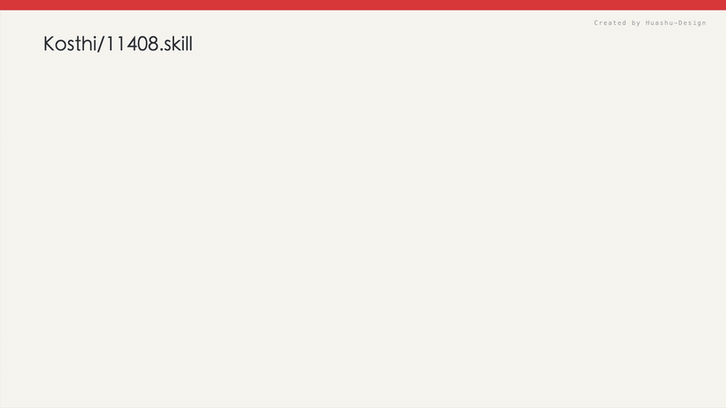

# 11408.skill

[](./LICENSE)
[](https://agentskills.io/)
[](#安装)

> **给 11408 考研党的 AI 备考教练：让你的 Agent 按考纲、考频、题型和易错点回答 408 + 数学一问题。**



很多人已经开始用 AI 复习，但通用 AI 经常有几个问题：

- 讲得像百科，不像考研答案
- 不区分高频低频，什么都展开
- 不提醒题型、分值和失分点
- 408 用词不贴考试，数学一又容易写得太抽象
- 每次都要重新解释“我是考 408 + 数学一”

`11408.skill` 做的事很简单：把 408 和数学一的考纲、考点优先级、解题模板、易错提醒写成一个可安装的 Agent Skill，让 Codex / Claude Code / Cursor 等支持 skills 的 AI 工具在回答时默认带着“考研备考教练”的上下文。

如果你本地接了 PageIndex MCP 并索引过 408 教材，它还能先检索教材原文，再输出这段内容对应的相关知识点、考频、题型和易错边界。

[看效果](#效果示例) · [安装](#安装) · [覆盖范围](#覆盖范围) · [怎么用](#怎么用) · [工作原理](#工作原理) · [诚实边界](#诚实边界)

---

## 效果示例

### 1. 问 408 概念

```text
用户  ❯ Cache 组相联地址划分怎么做？

AI   ❯ 这个点属于【计组-存储系统】，考频：极高，常见题型：选择题和综合应用题。

       一句话核心：
       地址划分一定按“块内地址 -> 组号 -> 标记”来拆，组号位数由 Cache 组数决定，
       不是由主存块数决定。

       做题顺序：
       1. 先算块大小，得到块内地址位数
       2. 再算 Cache 行数 / 相联度，得到组数
       3. 用 log2(组数) 得到组号位数
       4. 剩下高位就是标记位

       最容易丢分：
       - 把“行数”和“组数”混掉
       - 忘了组相联里：组数 = Cache 行数 / 相联度
```

### 2. 做错题诊断

```text
用户  ❯ 这道 PV 操作题我又写死锁了，错在哪？

AI   ❯ 你的断点更像是“同步关系和互斥关系没有分层”。

       PV 题不要先写代码，先做三步：
       1. 找共享资源：哪些地方必须互斥
       2. 找先后顺序：哪些动作必须等待另一个动作完成
       3. 再安排 P 操作顺序：通常同步 P 放在互斥 P 前，避免拿着锁等待条件

       检查死锁时只看一句话：
       有没有进程已经占住互斥资源，却在等别人发同步信号？
```

### 3. 问数学一

```text
用户  ❯ 线性方程组什么时候无解？

AI   ❯ 这个点属于【线代-线性方程组】，考频：极高。

       标准口径：
       非齐次线性方程组 Ax=b 是否有解，看系数矩阵 A 和增广矩阵 (A,b) 的秩。

       - r(A) = r(A,b)：有解
       - r(A) < r(A,b)：无解

       考研写法里不必写 ker/span，直接写“比较系数矩阵与增广矩阵的秩”即可。
```

### 4. 检索教材并输出相关知识点

```text
用户  ❯ 用 PageIndex 检索教材，Cache 地址映射这一段关联哪些知识点？

AI   ❯ 教材依据：
       - 计组教材对应存储系统章节，核心线索是主存块、Cache 行、组号、标记位和块内地址。

       相关知识点：
       1. Cache 地址划分｜考频：极高｜常见题型：选择、综合应用
          - 教材线索：主存地址按标记、组号、块内地址分解
          - 考试动作：先算块内位，再算组数，最后剩余位作为标记
          - 易错提醒：组数 = Cache 行数 / 相联度

       2. 组相联映射｜考频：极高｜常见题型：计算、命中缺失模拟
          - 教材线索：一个主存块只能映射到指定组，但可放入组内任意行
          - 考试动作：先定位组，再在组内比较标记
          - 易错提醒：不要把“组内任意行”和“全 Cache 任意行”混成全相联
```

这不是押题，也不是替你背书。它的价值是让 AI 回答时更稳定地贴近考试：先定位考点，再讲方法，再提醒容易丢分的边界；需要教材依据时，再把教材片段转成可复习的知识点清单。

---

## 安装

### 方式一：让 Agent 帮你装

如果你正在使用 Codex、Claude Code、Cursor 等支持 skills 的工具，可以直接对它说：

```text
帮我安装这个 skill：https://github.com/Kosthi/11408.skill
```

### 方式二：Codex 手动安装

```bash
mkdir -p ~/.codex/skills
git clone https://github.com/Kosthi/11408.skill.git ~/.codex/skills/kaoyan-11408
```

然后重启 Codex。

### 方式三：其他 runtime 手动安装

把仓库 clone 到对应工具的 `skills/` 目录即可：

| Runtime | 安装路径示例 |
| --- | --- |
| Codex CLI | `~/.codex/skills/kaoyan-11408/` |
| Claude Code | `~/.claude/skills/kaoyan-11408/` |
| Cursor | `~/.cursor/skills/kaoyan-11408/` |
| 其他支持 Agent Skills 的工具 | 对应 runtime 的 skills 目录 |

```bash
git clone https://github.com/Kosthi/11408.skill.git <你的 skills 目录>/kaoyan-11408
```

如果 runtime 不支持自动加载 skill，也可以直接把 `SKILL.md` 的内容粘贴进对话，把 `references/` 当作参考资料使用。

---

## 怎么用

安装后直接问备考问题即可：

```text
408 数据结构里排序稳定性怎么记？
```

```text
Cache 组相联地址划分给我举个例子。
```

```text
这道银行家算法题我哪里算错了？
```

```text
数学一二重积分换序总错，帮我诊断。
```

```text
距离考试还有 6 个月，408 和数学一怎么排优先级？
```

```text
用 PageIndex 检索教材，输出“流水线冲突”相关知识点。
```

如果你明确要求“做笔记 / 存到 Obsidian / 收错题”，它会按 Obsidian 笔记沉淀流程整理；普通问答不会主动改你的笔记库。

---

## 覆盖范围

### 408 计算机专业基础综合

| 科目 | 分值 | 覆盖重点 |
| --- | --- | --- |
| 数据结构 | 45 分 | 线性表、栈队列、树、图、查找、排序、算法设计 |
| 计算机组成原理 | 45 分 | 数据表示、运算器、存储系统、指令系统、CPU、I/O |
| 操作系统 | 35 分 | 进程线程、同步互斥、死锁、内存管理、文件系统、I/O |
| 计算机网络 | 25 分 | 体系结构、数据链路层、网络层、传输层、应用层 |

### 数学一

| 模块 | 覆盖重点 |
| --- | --- |
| 高等数学 | 极限、微分、中值定理、一元积分、多元函数、重积分、级数、微分方程 |
| 线性代数 | 行列式、矩阵、向量组、线性方程组、特征值、二次型 |
| 概率论与数理统计 | 随机变量、分布、数字特征、大数定律、中心极限定理、参数估计、假设检验 |

---

## 它内置了什么

| 文件 | 作用 |
| --- | --- |
| `SKILL.md` | skill 入口：定义回答风格、触发场景和交互模式 |
| `references/exam-overview.md` | 11408 考试结构、分值分布、复习时间线 |
| `references/exam-point-analysis.md` | 跨科目考点优先级：考频、题型、答题动作、易错提醒 |
| `references/2026-408-syllabus.md` | 2026 年 408 考纲整理 |
| `references/2026-math-one-syllabus.md` | 2026 年数学一考纲整理 |
| `references/data-structures.md` | 数据结构考点精析 |
| `references/computer-organization.md` | 计算机组成原理考点精析 |
| `references/operating-systems.md` | 操作系统考点精析 |
| `references/computer-networks.md` | 计算机网络考点精析 |
| `references/math-one.md` | 数学一考点精析 |
| `references/problem-solving-patterns.md` | 解题模板、答题规范、错题分析框架 |
| `references/obsidian-notes.md` | Obsidian 笔记沉淀流程模板 |

可选增强：

| 能力 | 作用 |
| --- | --- |
| PageIndex MCP 教材检索 | 检索本地已索引的 408 教材原文，把教材片段转成相关知识点、考频、题型、考试动作和易错提醒 |

---

## 工作原理

`11408.skill` 不是重新训练模型，而是给 Agent 一套稳定的备考上下文和回答规则：

**1. 先定位考点**
判断问题属于哪一科、哪一章、考频高不高、常见题型是什么。

**2. 再给标准结论**
概念题先给一句话核心，计算题先定公式和单位，证明题先找目标式和辅助函数。

**3. 高频点展开，低频点收住**
数据结构的树图排序、计组的 Cache/流水线、OS 的 PV/死锁/分页、计网的 TCP/子网等会重点展开；低频点不占用太多篇幅。

**4. 主动提醒失分边界**
例如 Cache 行数和组数、Dijkstra 负权边、SR 窗口上限、变上限积分链式法则、线代秩的比较口径。

**5. 需要沉淀时再写笔记**
只有用户明确说“做笔记 / 存到 Obsidian / 收错题”时才进入笔记流程，避免普通问答误改知识库。

**6. 需要教材依据时再走 PageIndex**
当用户要求教材原文、教材依据或相关知识点映射时，先用 PageIndex MCP 检索本地教材索引，再把检索片段转成考研视角的知识点清单，而不是只贴原文。

---

## 诚实边界

- 它不是官方资料，最终范围以教育部考试大纲、目标院校公告和历年真题为准。
- 它不承诺押题、保分、包过。
- 数学和 408 题目仍需要你提供完整题干；题干缺失时只能给条件化分析。
- PageIndex 教材检索依赖你本地已安装 PageIndex MCP，并且已经索引合法教材文件；没有索引时只能退回参考文件和通用解释。
- Obsidian 工作流需要按你自己的 vault 路径和属性体系调整，不能直接假设所有人都一样。
- 本仓库不会提交教材 PDF；如你本地使用教材索引，请自行确保版权合规。

一个不说明边界的备考工具，不值得信任。

---

## 适合谁

- 正在准备 408 + 数学一的计算机考研党
- 已经在用 Codex / Claude Code / Cursor 辅助学习的人
- 想让 AI 回答更贴近考研题型，而不是泛泛解释概念的人
- 用 Obsidian 做错题和知识点沉淀的人

不太适合：

- 只想要完整网课替代品的人
- 只想要押题和捷径的人
- 不愿意核对真题和官方大纲的人

---

## 仓库结构

```text
11408.skill/
├── SKILL.md
├── references/
│   ├── 2026-408-syllabus.md
│   ├── 2026-math-one-syllabus.md
│   ├── exam-overview.md
│   ├── exam-point-analysis.md
│   ├── data-structures.md
│   ├── computer-organization.md
│   ├── operating-systems.md
│   ├── computer-networks.md
│   ├── math-one.md
│   ├── problem-solving-patterns.md
│   └── obsidian-notes.md
└── LICENSE
```

---

## 路线图

- [ ] 增加更多真题风格示例
- [ ] 补充常见错题诊断样例
- [ ] 增加可复用的 Obsidian 笔记模板
- [ ] 增加安装后自测问题集
- [ ] 根据 2026 真题继续校准考频和题型

---

## 许可证

MIT — 可以自由使用、修改和分发。

---

**11408.skill 不是让 AI 替你复习。**
**它是让 AI 别再用泛泛而谈的方式陪你复习。**
